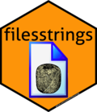

# filesstrings 

This started out as a package for file and string manipulation. Since
then, the `fs` file manipulation package and the \`strex string
manipulation package emerged, offering functionality previously given by
this package (but slightly better). Those packages have hence almost
pushed ‘filesstrings’ into extinction. However, it still has a small
number of unique, handy file manipulation functions which can be seen in
the
[vignette](https://cran.r-project.org/package=filesstrings/vignettes/files.html).
One example is a function to remove spaces from all file names in a
directory.

[](https://travis-ci.org/rorynolan/filesstrings)
[](https://ci.appveyor.com/project/rorynolan/filesstrings)
[](https://codecov.io/gh/rorynolan/filesstrings)

[](https://www.tidyverse.org/lifecycle/#stable)
[](https://www.repostatus.org/#inactive)

[](https://cran.r-project.org/package=filesstrings)


[](https://www.rdocumentation.org/packages/filesstrings)

[](https://doi.org/10.21105/joss.00260)
[](https://zenodo.org/badge/latestdoi/69170704)

# Installation

To install the release version of `filesstrings` from
[CRAN](https://cran.r-project.org/package=filesstrings), in R, enter

``` r
install.packages("filesstrings")
```
